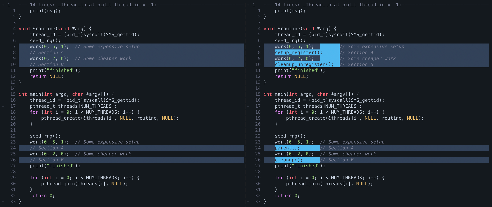

# forkall

This project serves as a PoC on how one potentially could implement forkserver with the ability to restore all target threads and not just the main thread. There are many alternative, and potentially better, ways to achieve the same result.

## Design

The key idea is simple.

1. **Setup:** Run target $X$ until all $N$ threads $t^X_i$ are in their desired non-critical sections $A_i$.
2. **Snapshot:** For all threads except the main thread $t^X_0$, attach `ptrace` and retrieve all registers.
3. **Recreate:** Fork the main thread to create a full copy $t^Y_0$ and create $N-1$ bootstrapping threads.
4. **Restore:** For all threads in $Y$ except $t^Y_0$, attach `ptrace` and set all registers.
5. **Cleanup:** After all $t^Y_i$ have reached their target sections $B_i$, artifacts should be cleaned up, and the process proceeds to step 3.

### Setup

It is nontrivial to automatically select threads and find a good spot to pause them. Thus, this is currently done manually. We also need to devise a way to pause all threads and then unpause them from another thread. Typically, this is done using atomics or mutexes, as a static global variable leads to race conditions. However, this would violate our constraint of not being in a critical section. Additionally, we cannot rely on `PTRACE_ATTACH` to pause the thread for us, as the target may continue running indefinitely before stopping. 

The solution is a simple `while(true)` loop that we insert at the target location. We include a `sleep` inside this loop to conserve resources. It is implemented predictably so that after restoring, we can resume the threads by incrementing `RIP` and jumping over the loop condition.

```c
/* Pause function to "stop" the threads cheaply
 * in a non-critical section. They cannot continue on their own but
 * instead need RIP += 0xF to jump over the loop condition.
 * We use a volatile variable to avoid DCE removing things after the loop
 * and assembly to make sure the spacing is correct.
 */
volatile int continue_loop = 1;

void pause_me() {
    __asm__ volatile(
        "jmp check_loop\n\t"

        "loop_body:\n\t"
        "movl $1000000, %%edi\n\t"
        "call usleep\n\t"

        "marker: .byte " STR(MARKER) "\n\t"

        "check_loop:\n\t"
        "movl continue_loop(%%rip), %%eax\n\t"
        "testl %%eax, %%eax\n\t"
        "jnz loop_body\n\t"

        : /* no outputs */
        : /* no inputs */
        : "eax", "edi", "memory"
    );
    puts("Resumed.\n");
}
```

Since the number of threads expected to reach the target location is known, we can use an atomic variable to track their progress. Each thread increments the counter upon arrival, and the system waits until the counter matches the expected number of threads. Once all threads have reached their designated sections $A_i$, the snapshotting process begins.

### Snapshot

Snapshotting involves iterating over each thread, attaching `ptrace`, waiting for them to stop, retrieving and storing their registers, and finally detaching. Since `ptrace` cannot attach to threads within the same thread group, we perform a `fork` after all threads have reached the pause section. By instrumenting all threads to store their thread ID (`tid`) in a static global variable and forking, which copies the entire address space, we can easily iterate over all threads and attach to them.

Attaching causes the thread to stop at a random point in time. Because `usleep` is a system call that suspends the thread for a specific duration, it is likely that the thread stops while inside the syscall, which is an undesirable state for snapshotting. While there are more sophisticated methods to detect being in a syscall, for simplicity, we chose to insert a marker after sleeping. This marker not only ensures that the thread is not in a syscall but also indicates the exact position of the thread without requiring hardcoded absolute values such as `RIP`. We opted to use a 5-byte NOP (`nop DWORD PTR [rax+rax*1+0x0]`) as the marker because it is rare and does not impact execution.

After attaching `ptrace`, we retrieve all the registers and use `PTRACE_PEEKTEXT` at `RIP` to compare the bytes to our marker. If the bytes do not match, we perform a single step; if they do, we exit the loop because the registers have been captured at the desired location. To ensure threads resume execution properly after restoration, we increment `RIP` by `0xF` to jump over the loop condition. This is feasible because the marker provides a relative reference point for the thread's location. Finally, we store the registers in a variable on the stack, which remains accessible to the child process after forking.

### Recreate

Recreating the main thread and duplicating the address space is straightforward, as `fork` performs exactly that. For simplicity, we fork the tracing process, utilizing the stored registers for each thread already available on the stack.  We then create $N-1$ bootstrapping threads and similar to the setup phase, an atomic variable is used here to track progress, and the system waits until the expected number of threads have been created. Once all threads have been started, we signal the tracer to begin the restoration process.

### Restore

Restoration faces challenges similar to snapshotting due to `ptrace` requiring the threads to be in a different thread group. One approach is to fork and let the new process handle register restoration, or alternatively, signal the parent process to perform this task. There are several ways to pass the thread IDs (TIDs) of the created threads to the process responsible for attaching to them. Since we recreate the threads and the parent knows the PID of the child process, we can enumerate the threads by iterating over `/proc/%d/task`, skipping the main thread, and restoring the remaining ones. The order does not matter. Once the registers are set, the threads will resume execution immediately after the loop condition once ptrace is detached.

### Cleanup

After restoring the threads all run until the target section $B_i$ is reached and are then forced to exit. The main thread will wait for all threads to exit before exiting itself. The tracer waits for $t^Y_0$ to exit before starting the entire process of recreation again.


## Patches

Currently, we apply two patches to `libc` to make this work. First, we prevent `fork` from [reclaiming the stacks](https://elixir.bootlin.com/glibc/glibc-2.39/source/posix/fork.c#L106), as otherwise all stacks except the one from the main thread would be added to the free list and later reused if applicable. Second, we prevent the other arenas from being [placed on the free list](https://elixir.bootlin.com/glibc/glibc-2.39/source/malloc/arena.c#L221-L223), as well as stop the [attached thread counts of the main arena from being reset](https://elixir.bootlin.com/glibc/glibc-2.39/source/malloc/arena.c#L213). Without these patches, we would trigger an [assertion failure](https://elixir.bootlin.com/glibc/glibc-2.39/source/malloc/arena.c#L907) during program exit.

## Instrumentation

If all assumptions are met, instrumentation is as simple as inserting the corresponding setup, cleanup, and parent functions at locations $A$ and $B$ of both the main thread and any additional threads. Additionally, `NUM_THREADS` needs to be correctly defined in a header file called `config.h`. If more verbose logging is desired, one can define `DEBUG` in the same configuration header.



## Limitations

Many =^w^=.

TODO